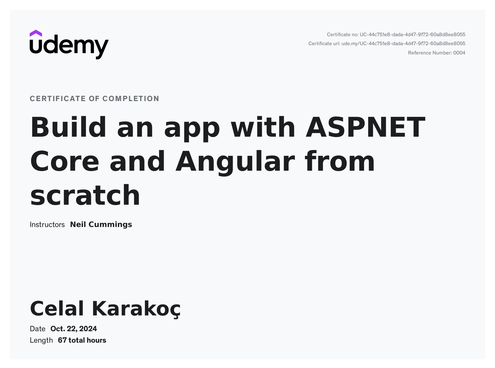
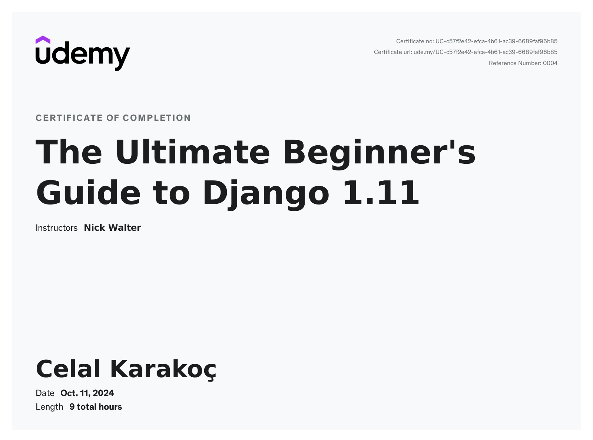
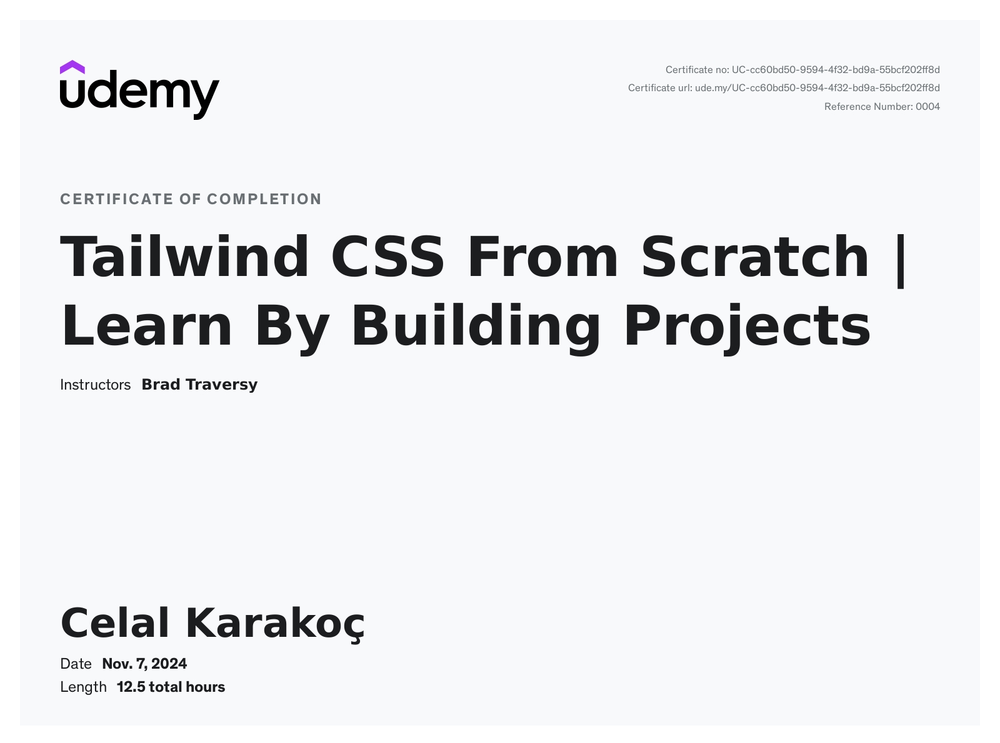
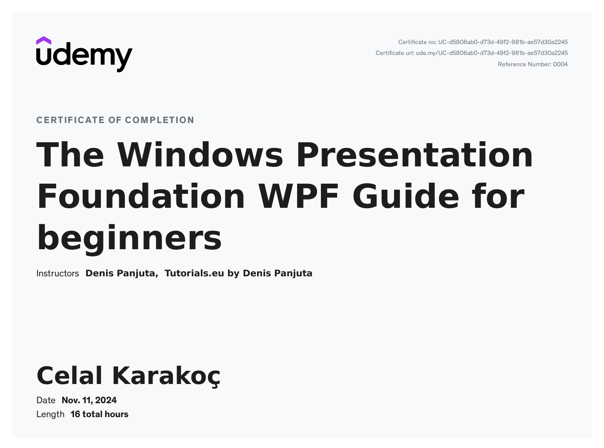
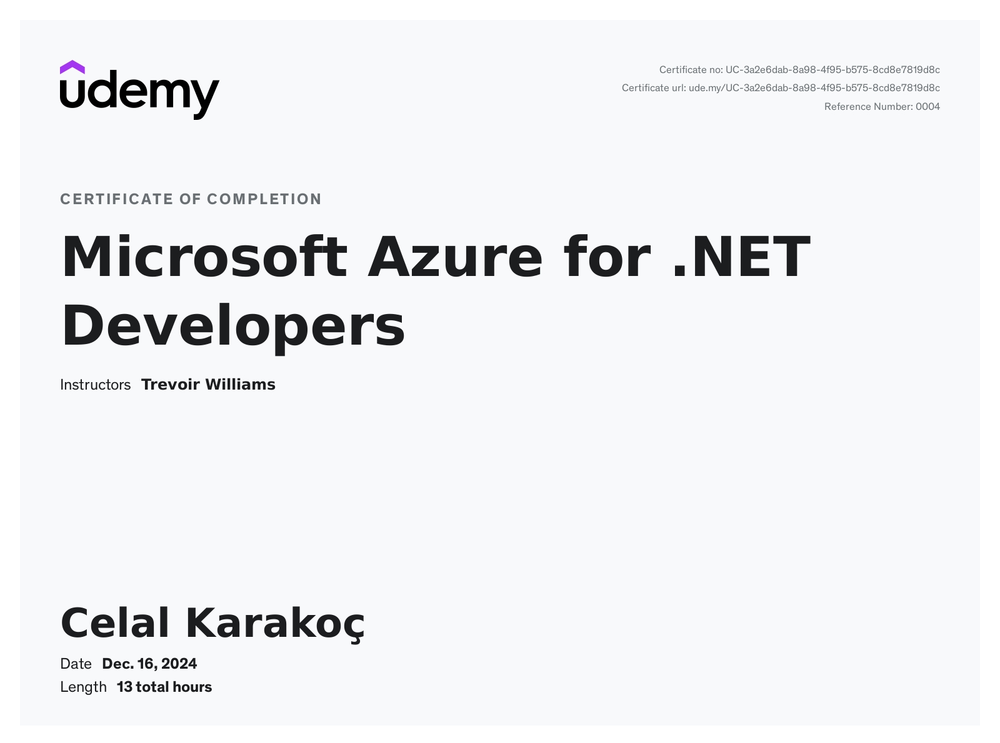
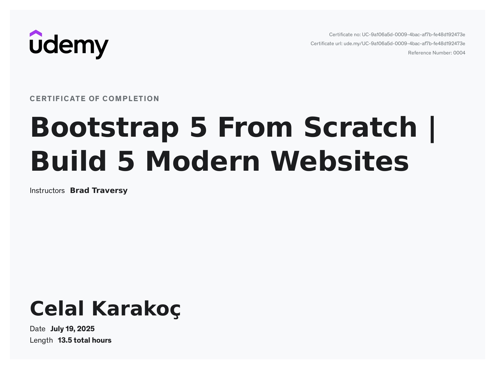
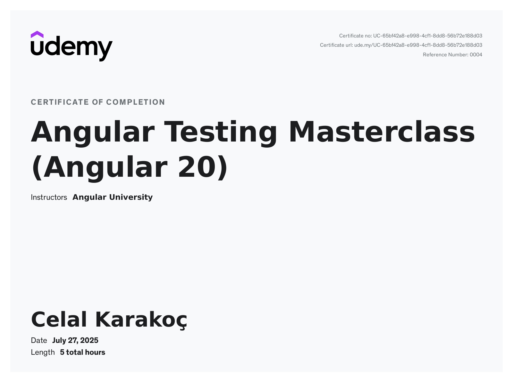
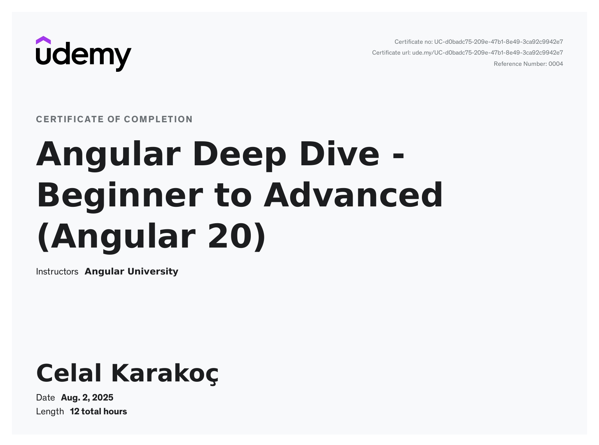
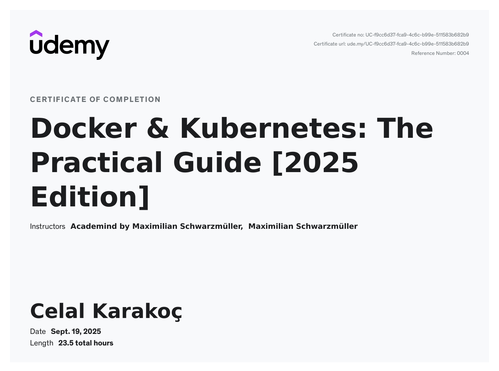
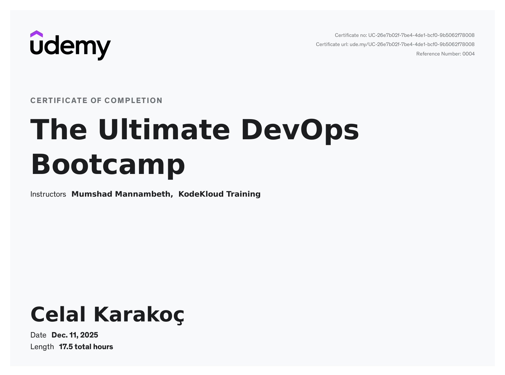

# Certificates of Completion
## Udemy 

| Repositories                                                                                                                                                                       | Certificate |
|------------------------------------------------------------------------------------------------------------------------------------------------------------------------------------| --- |
| Udemy: Build an app with ASPNET Core and Angular from scratch [1](https://github.com/ckarakoc/DatingApp)                                                                |  |
| Udemy: The Ultimate Beginner's Guide to Django 1.11                                                                                                                                |  |
| Udemy: Tailwind CSS From Scratch [1](https://ckarakoc.github.io/TailwindFromScratch/)                                                                                   |  |
| Udemy: The Windows Presentation Foundation WPF Guide for beginners [1](https://github.com/ckarakoc/WpfApp) [2](https://github.com/ckarakoc/WindowsStoreClone) |  |
| Udemy: Microsoft Azure for .NET Developers [1](https://github.com/ckarakoc/Cloud)              |  |
| Udemy: Bootstrap 5 From Scratch [1](https://ckarakoc.github.io/BootstrapFromScratch/)                                                                                   |  |
| Udemy: Angular Testing Masterclass (Angular 20) [1](https://github.com/ckarakoc/angular-testing)                                                                                   |  |
| Udemy: Angular Deep Dive - Beginner to Advanced (Angular 20)                                                                               |  |
| Udemy: Docker & Kubernetes: The Practical Guide \[2025 Edition\]                                                                           |  |
| Udemy: The Ultimate DevOps Bootcamp                                                                            |  |

## Cloud

| Repositories                                                                                                                                                                       | Certificate |
|------------------------------------------------------------------------------------------------------------------------------------------------------------------------------------| --- |
| Azure: AZ-900                                                                                                                                                                      | NEXT UP |

## Java 

| Repositories                                                                                                                                                                       | Certificate |
|------------------------------------------------------------------------------------------------------------------------------------------------------------------------------------| --- |
| Baeldung                                                                                                                                                                           | NEXT UP |

## Tutorials made, without a certificate

| Projects | Repositories |
| --- | --- |
| [Java - Spring Boot 3 Microservices portfolio project](https://www.youtube.com/watch?v=-pv5pMBlMxs) | [Repo](https://github.com/ckarakoc/leetjourney-microservices) |
| [Java - Production-Ready Patient Management System with Microservices](https://www.youtube.com/watch?v=tseqdcFfTUY&t=42687s) | [Repo](https://github.com/ckarakoc/patient-management) |
| [Angular - Angular chat ui](https://ckarakoc.github.io/ng-chat-ui-setup/) | [Repo](https://github.com/ckarakoc/ng-chat-ui-setup) |
| [Angular - Housing Website Tutorial](https://ckarakoc.github.io/Angular/) |[Repo](https://github.com/ckarakoc/Angular) |
| [Angular - Hero Website Tutorial](https://ckarakoc.github.io/AngularHero/heroes) | [Repo](https://github.com/ckarakoc/AngularHero) |
| [Angular - Form Website Tutorial](https://ckarakoc.github.io/AngularForm/) | [Repo](https://github.com/ckarakoc/AngularForm) |
| [Udemy - React InvestmentCalculator](https://ckarakoc.github.io/InvestmentCalculator/) | [Repo](https://github.com/ckarakoc/InvestmentCalculator) |
| [Udemy - React Goal Tracker](https://ckarakoc.github.io/DemoProjectS7/) | [Repo](https://github.com/ckarakoc/DemoProjectS7) |
| [Udemy - React Expense Tracker](https://ckarakoc.github.io/ExpenseTracker/) | [Repo](https://github.com/ckarakoc/ExpenseTracker) |
| [Udemy - React Concept Page](https://ckarakoc.github.io/ExampleStartingReactSite/) | [Repo](https://github.com/ckarakoc/ExampleStartingReactSite) |
